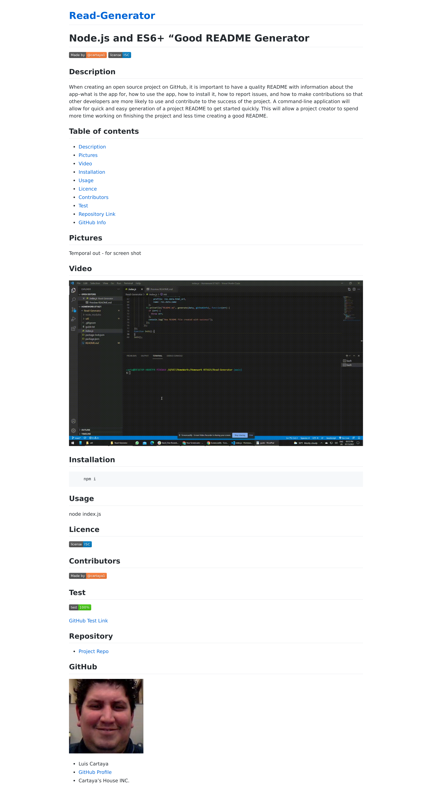

# **Node.js and ES6+ "Good README Generator**

## Description - Descripcion

When creating an open source project on GitHub, it is important to have a quality README with information about the app--what is the app for, how to use the app, how to install it, how to report issues, and how to make contributions so that other developers are more likely to use and contribute to the success of the project. A command-line application will allow for quick and easy generation of a project README to get started quickly. This will allow a project creator to spend more time working on finishing the project and less time creating a good README.   

Al crear un proyecto de código abierto en GitHub, es importante tener un README de calidad con información sobre la aplicación: para qué es la aplicación, cómo usarla, cómo instalarla, cómo informar problemas y cómo Haga contribuciones para que otros desarrolladores tengan más probabilidades de utilizar y contribuir al éxito del proyecto. Una aplicación de línea de comandos permitirá la generación rápida y sencilla de un README de proyecto para comenzar rápidamente. Esto permitirá al creador de un proyecto dedicar más tiempo a terminar el proyecto y menos tiempo a crear un buen archivo README.

## Table of contents - Tabla de Contenido

- [Description](#Description)
- [Images](#Images)
- [Video](#Video)
- [Installation](#Installation)
- [Usage](#Usage)
- [Licence](#Licence)
- [Contributors](#Contributors)
- [Test](#Test)
- [Repository Link](#Repository)
- [GitHub Info](#GitHub) 

## Images - Imagenes 

## Video

## Installation - Instalacion

        npm i

## Usage - Como Usar

node index.js

## Licence - Licencia

## Contributors - Colaboradores

## Test - Prueba

[GitHub Test Link](https://cartaya1.github.io/Read-Generator/)

## Repository - Repositorio

- [Project Repo](https://github.com/cartaya1/Read-Generator)

## GitHub

- Luis Cartaya
- [GitHub Profile](https://github.com/cartaya1)
- Cartaya's House INC.
